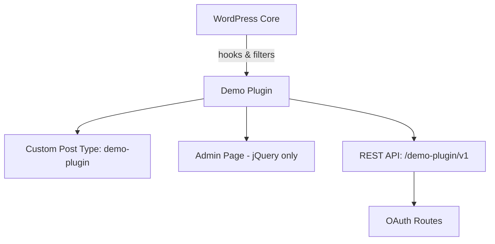

# Demo Plugin

**Contributors:** abrahamgomez  
**Requires at least:** 6.4  
**Tested up to:** 6.6  
**Requires PHP:** 8.2  
**Stable tag:** 1.0.0  
**License:** GPLv3  
**License URI:** http://www.gnu.org/licenses/gpl-3.0.txt  

A minimal, production-ready scaffolding for a WordPress plugin with PSR-4 autoloading, a sample CPT, and OAuth-only REST routes.

## Description

This is a clean starting point for building modern WordPress plugins. Features include:

- **PSR-4 autoloading** via Composer  
- **Admin page stubs** (jQuery-only, no CSS)  
- **Custom Post Type** `demo-plugin`  
- **REST API** endpoints under `/demo-plugin/v1`, with **OAuth-only routes** as examples  

Useful as a base for more complex plugin development without extra boilerplate.

---

### File Structure

```text
demo-plugin/
├── composer.json
├── composer.lock
├── demo-plugin.php          # Main plugin bootstrap file
├── src/
│   ├── Admin/
│   │   └── AdminPage.php    # Example jQuery-based admin page
│   ├── CPT/
│   │   └── DemoPlugin.php   # CPT registration
│   ├── REST/
│   │   └── OAuthRoutes.php  # REST API route stubs
│   └── Plugin.php           # Core plugin loader
├── vendor/                  # Composer dependencies
└── README.md (this file)
```

---

### Architecture Diagram (Mermaid)

> GitHub sometimes fails if lines are implicitly wrapped.  
> This version uses explicit node IDs and semicolons—copy/paste exactly as-is.



---

## Installation

1. Upload the plugin folder to `/wp-content/plugins/`.  
2. Run `composer install` inside the plugin folder.  
3. Activate **Demo Plugin** via the WordPress **Plugins** screen.  

---

## Changelog

### 1.0.0
* Initial release with CPT, admin page stub, and OAuth REST routes.
